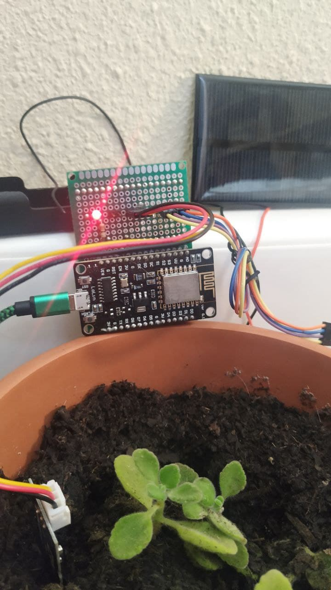

# Weak Garden Controller

This is a garden controller designed for nodeMCU development board. Implements MQTT/TCP client. It is configured through a header C file.

## Features
1. PlatformIO: simple development, build and upload
2. Arduino Framework
3. NodeMCU - ESP8266-12E
4. Wifi
5. MQTT
    1. 3 topics for BME280
    2. 1 topic for MoistureSoil sensor
6. BME280 [SPI-MODE] (Presure, Humidity, Temperature) and MoistureSoil [AnalogRead]
7. Status led.
8. Jumper for RST mode.

## Roadmap

1. OTA Update
2. DeepSleep and eco function
3. Sensor Module
4. Simple configure method: UI over WIFI/Bluetooth
5. Custom PCB
6. 3D Print Case
